# ShowMeTheCode
Check out the hackerspace tools and hardware details.

# Tools and Equipment for Electronics workbench

| Name | Info  | Image |
| --- |  --- | :---: |
| [CT-8A_F-08A](https://robu.in/product/ct-8a-transmitterf-08a-receiverpwm/) | CT-8A Transmitter+F-08A Receiver(PWM) | 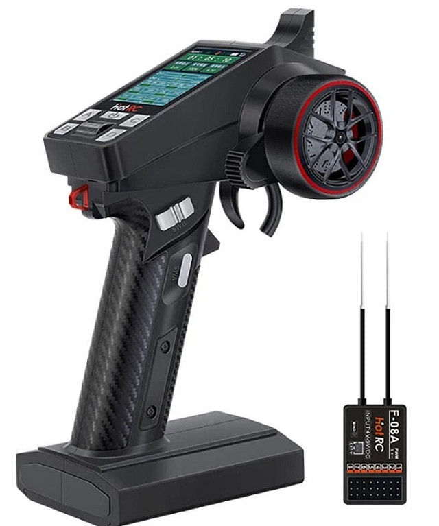 |
| [Hantek6022BL](https://www.hantek.com/m/productDetail/153) | 20MHz Bandwidth; 48MSa/s Sample Rate; 16 Channels Logic Analyzer |  |
| [MAS830L](https://mastech-group.com/as/en/MAS830L) | Digital Multimeter |  |
| [EZP2019](https://robu.in/product/ezp2019-high-speed-usb-spi-programmer-support-24-25-26-93-series-chip-eeprom-flash-bios-standard-configuration/) | This is EZP2019+ High Speed USB SPI Programmer Support 24/25/26/93 Series Chip EEPROM Flash Bios Standard configuration. | 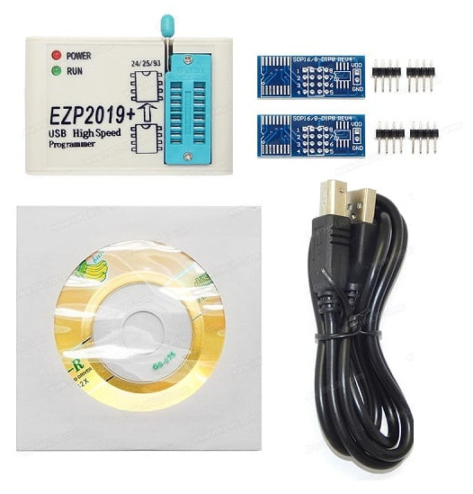 |
| [PCB Ruler](https://robu.in/product/multipurpose-pcb-ruler-engineering-measuring-tool-1pcs/) | design and develop the PCBs and Circuits | 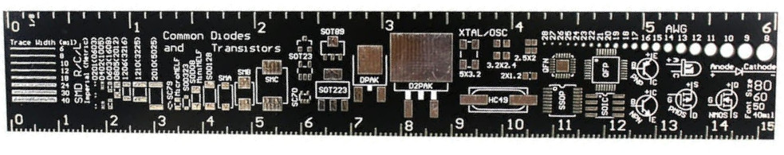 |
| [SMD Rework Station](https://) | Baku 850 SMD Rework Station | 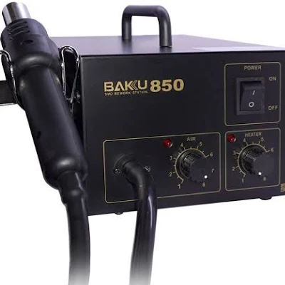 |
| [Soldering Iron](https://) | Soldering Iron (25W) |  |
| [Micro Soldering](https://) | Micro Soldering Iron (12W) |  |
| [Desoldering Pump](https://) | Desoldering Pump |  |
| [Hot Glue Gun](https://) | Hot Glue Gun (20W) |  |

PCB Ruler
    
# Development board

| Name | Info  | Image |
| --- |  --- | :---: |
| [EPM240T100C5N](https://robu.in/product/altera-max-ii-epm240-cpld-development-board/) | Altera MAX II EPM240 CPLD Development Board |  |
| [USB_Blaster](https://robu.in/product/usb-blaster-altera-cpld-fpga-programmer/) | USB Blaster ALTERA CPLD/FPGA programmer  | 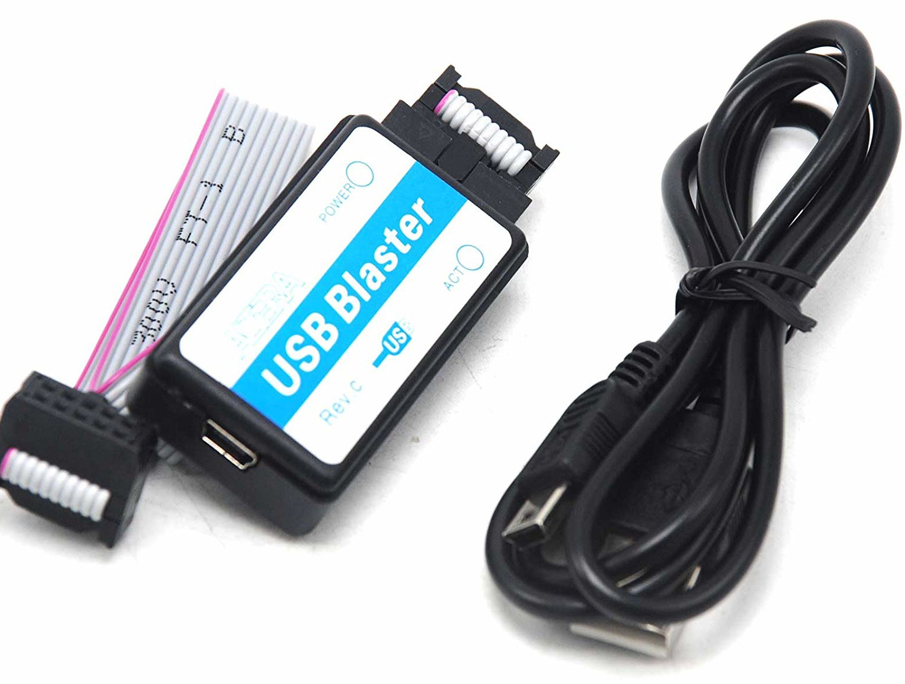 |
| [ALTERA FPGA Cyclone II ](https://robu.in/product/altera-fpga-cyclone-ii-ep2c5t144-system-development-board/) | ALTERA company’s Cyclone II EP2C5T144 chip as the core of the smallest system, the FPGA easily embedded in the actual application system  |  |
| [Pi_Pico](https://robu.in/product/raspberry-pi-pico/) | RP2040 microcontroller chip designed by Raspberry Pi | 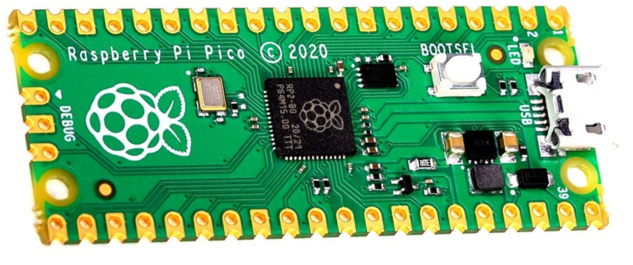 |

# Module
 - Can be connected to different types of development boards

| Name | Info  | Image | Schematic |
| --- |  --- |  --- | :---: |
| [MAX6675](https://robu.in/product/max6675-module-k-type-thermocouple-sensor-measure-1024-degrees-temperature/) |  K Type Thermocouple Sensor Measure 1024°C  |  |
| [W5500](https://robu.in/product/spi-to-ethernet-hardware-tcp-ip-w5500-ethernet-network-module/) |  W5500 Ethernet Network Module |  | 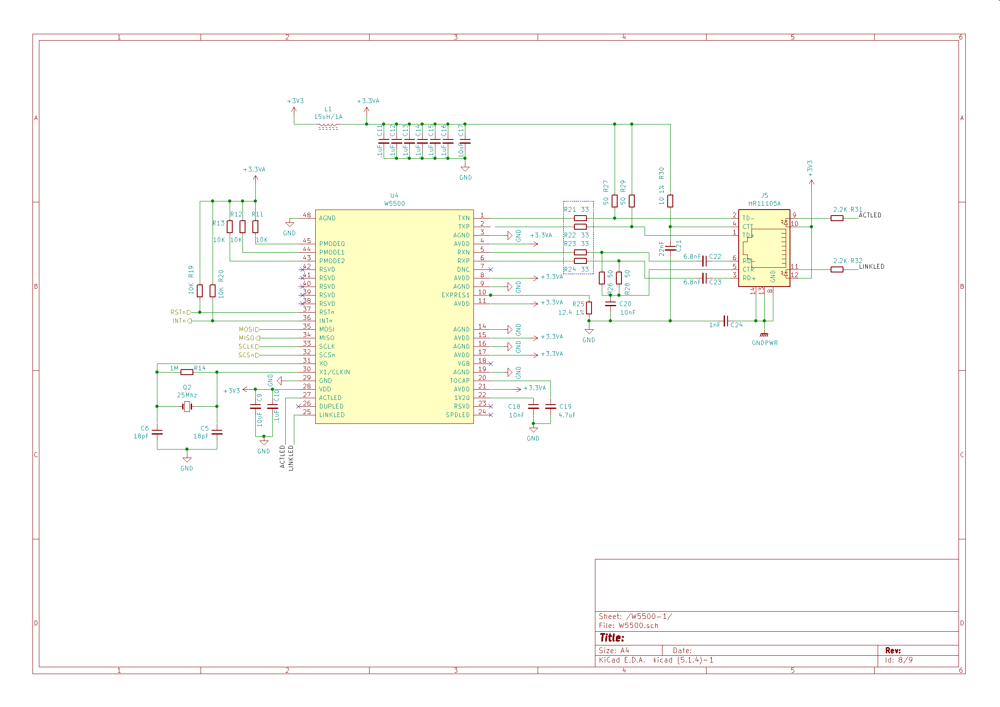 | not_yet|
| [STX882](https://robu.in/product/433mhz-100-meters-stx882-ask-transmitter-module-srx882-superheterodyne-receiver-module-antenna/) |  433MHz 100 Meters STX882 ASK Transmitter Module + SRX882 Superheterodyne Receiver Module + Antenna | 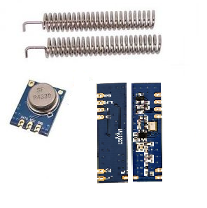 | not_yet|
| [NRF24L01](https://robu.in/product/2-4ghz-nrf24l01palna-sma-antenna-wireless-transceiver-communication-module-1km/) |  2.4GHz NRF24L01+PA+LNA SMA Wireless Transceiver Antenna | 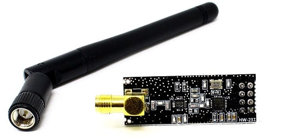  | not_yet|
| [M177 NRF24L01](https://robu.in/product/m177-nrf24l01-2-4ghz-antenna-wireless-transceiver-module/) | M177 NRF24L01 2.4GHz Antenna Wireless Transceiver Module.   |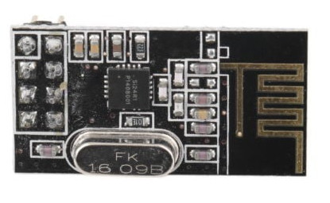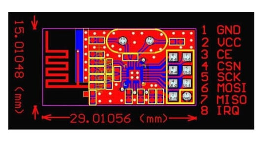 | not_yet|
| [3.3V Adapter Board](https://robu.in/product/3-3v-adapter-board-for-24l01-wireless-module/) | It can be used with NRF24L01 wireless module  ||
| [HC-12 433 SI4463](https://robu.in/product/hc-12-433-si4463-wireless-serial-module/) | HC-12 wireless RF UART communication module is a new generation of multi-channel embedded wireless data transmission module.  || not_yet|
| [Waveshare_LCD](https://robu.in/product/waveshare-2-inch-lcd-display-module-240x320/) | Waveshare 2 Inch LCD Display Module 240×320 |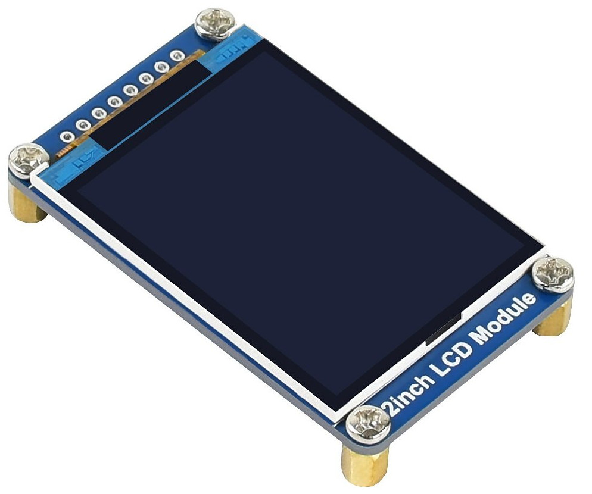|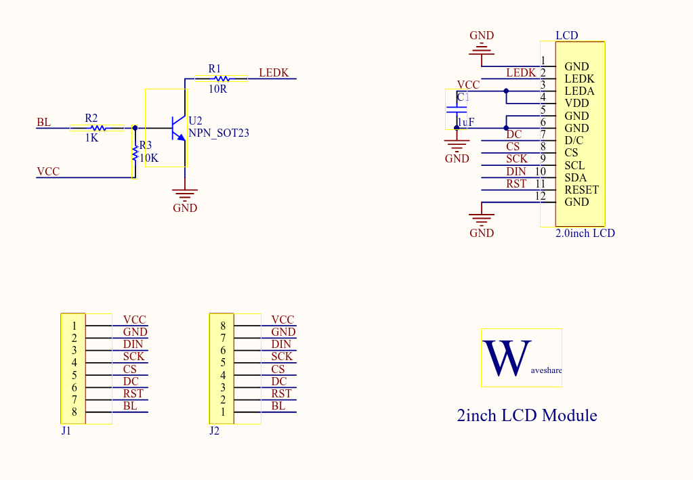|

# Shield 

## Arduino_nano
 - Designed specifically to stack on top of a microcontroller board

| Name | Info  | Image |Schematic |
| --- |  --- | :---: |---- |
| [Nano ENC28J60 Ethernet Shield ](https://robu.in/product/nano-enc28j60-ethernet-shield-v1-0-networking-module/) | The Nano ENC28J60 Ethernet Shield V1.0 is a compact and versatile networking module designed for Arduino Nano boards.   |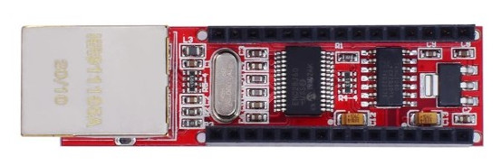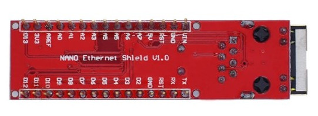| https://github.com/e-Gizmo/Ethernet-Shield-ENC28J60- |

# Expansion-board
 - Designed to expand the functionality of a system.

| Name | Info  | Image |
| --- |  --- | :---: |
| [ESP32 Expansion Board](https://robu.in/product/30pin-esp32-expansion-board-with-type-c-usb-and-micro-usb-dual-interface-for-esp32-esp-32-esp-32s-development-board/) |  Micro USB Dual Interface for ESP32 ESP-32 ESP-32S Development Board  |  |

