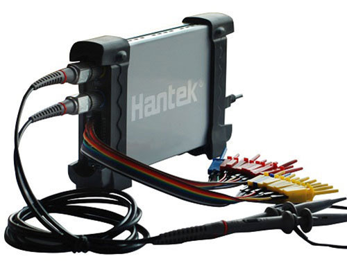

# ShowMeTheCode
Check out the hackerspace tools and hardware details.

#TOOLS

| Name | Info  | Image |
| --- |  --- | :---: |
| [Hantek6022BL](https://www.hantek.com/m/productDetail/153) | 20MHz Bandwidth; 48MSa/s Sample Rate; 16 Channels Logic Analyzer |  |
| [MAS830L](https://mastech-group.com/as/en/MAS830L) | Digital Multimeter |  |
| [SMD Rework Station](https://) | Baku 850 SMD Rework Station |  |
| [Soldering Iron](https://) | Soldering Iron (25W) |  |
| [Micro Soldering](https://) | Micro Soldering Iron (12W) |  |
| [Desoldering Pump](https://) | Desoldering Pump |  |
| [Hot Glue Gun](https://) | Hot Glue Gun (20W) |  |

 

    
    
   
